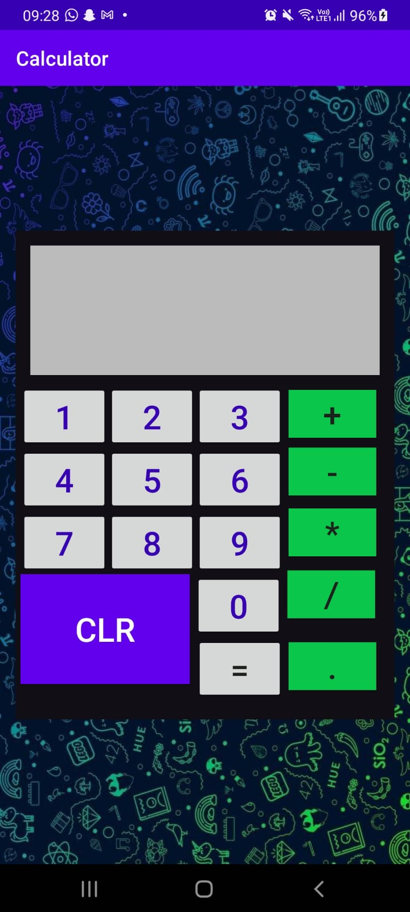
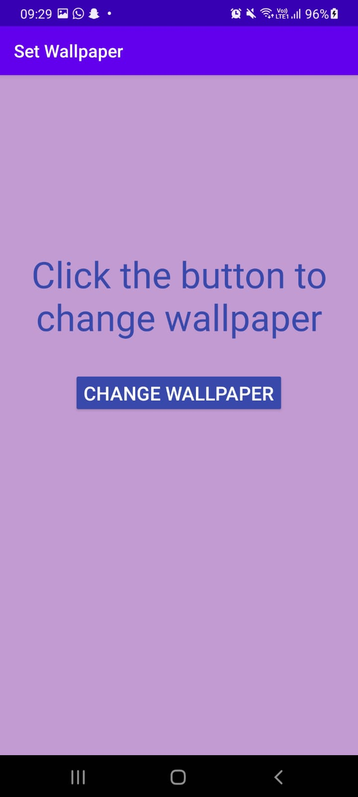
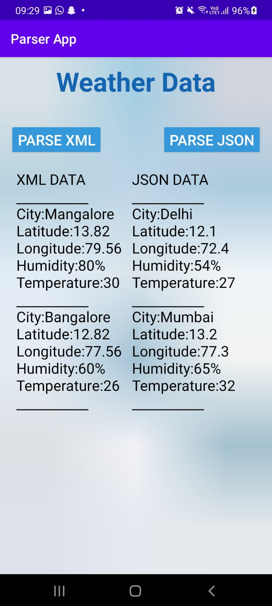
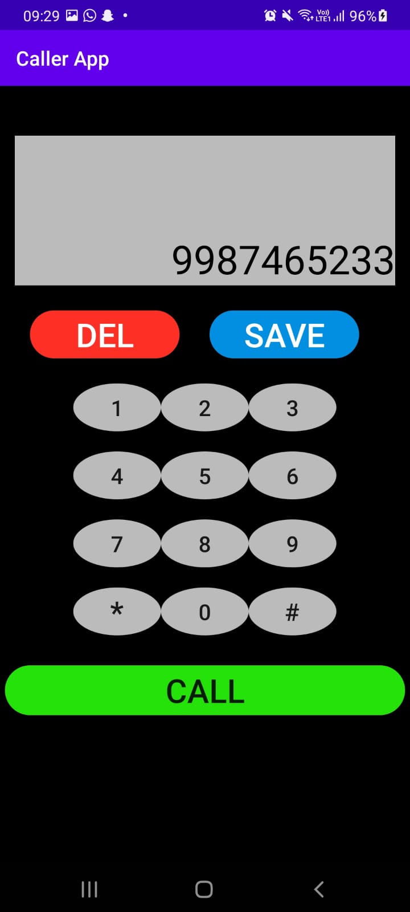
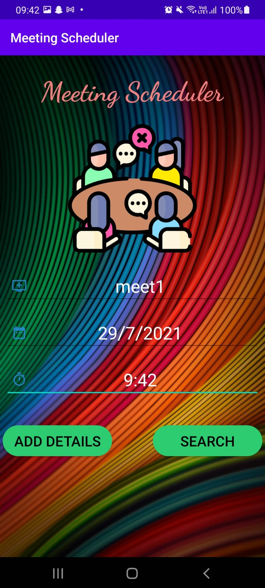

<h1 align="center">:sparkler: Multitasker Application :sparkler:</h1> 
---

<h2>Overview</h2>

* The repository is a collection of the lab programs in the VTU course: Mobile Application Development Laboratory(18CSMP68) in a One Application.

* It is an App that provides Part A and Few Part B Application in this Single App 

<ol>
   <li>Part A provides the following Applications :
         <ul>
               <li> Calculator App </li>
               <li> Counter App </li>
               <li> Wallpaper Changer App </li>
               <li> XML and JSON Parser App </li>
               <li> Text to Speech Converter App </li>
               <li> Caller App </li>
         </ul>
   </li>
   <li>Part B provides following App:
         <ul>
               <li> Meeting Scheduler </li>
               <li> Media Player </li>
         </ul>
   </li>
</ol>

<h2> Pre-requisites </h2>

In order to use the applications, you must have the following installed:

* Android Studio  
* Android SDK version 29  
* JDK8  
* Emulator or can use Android Device  

<h2>Screenshots</h2>

  
  
  

 

  
  
  

 

Part A 

 
  
  
  

 

  
  
  

 

Part B 

 
  
  
  

    
   

   
   
